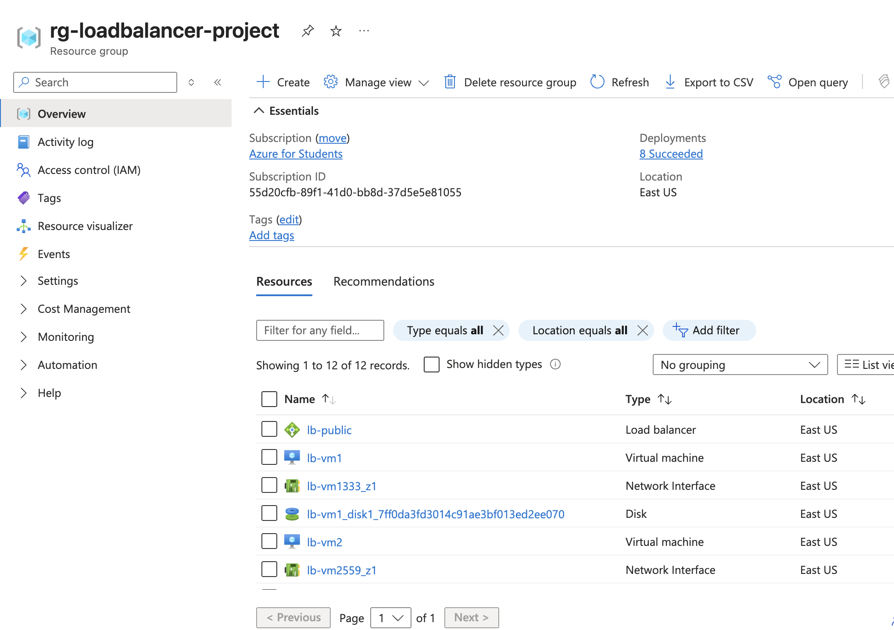
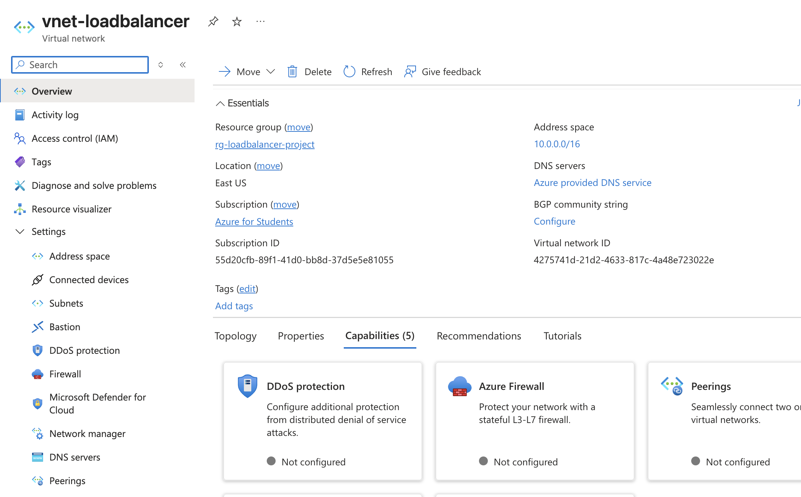
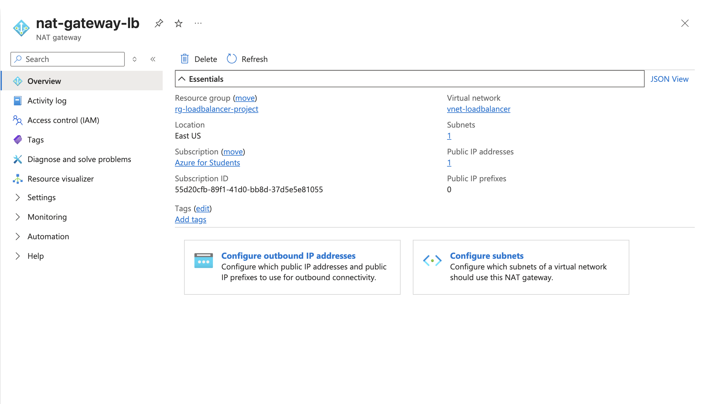
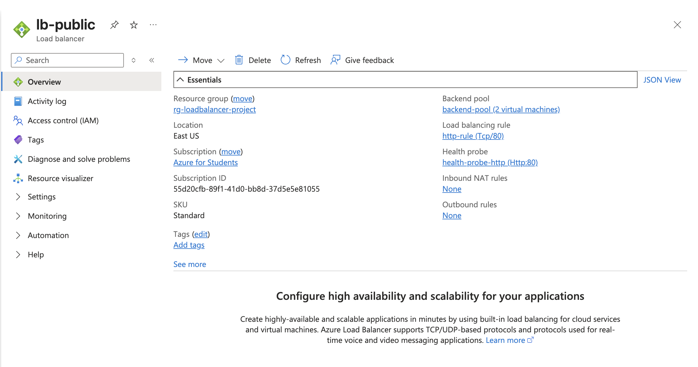
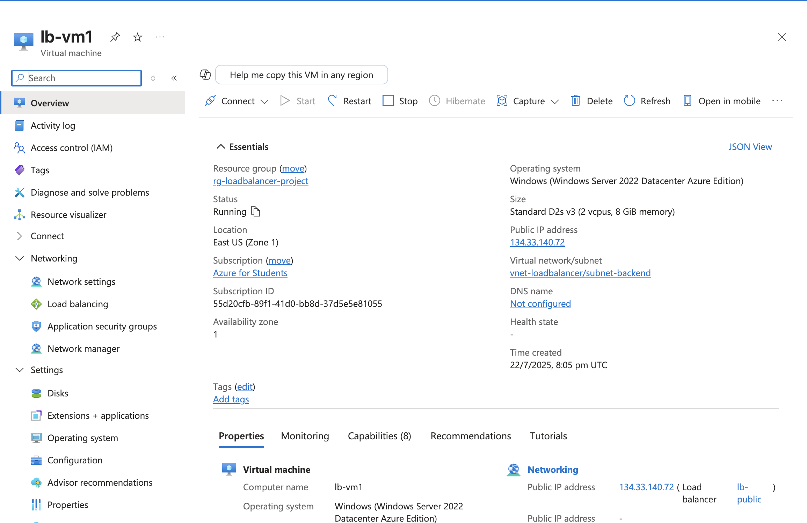
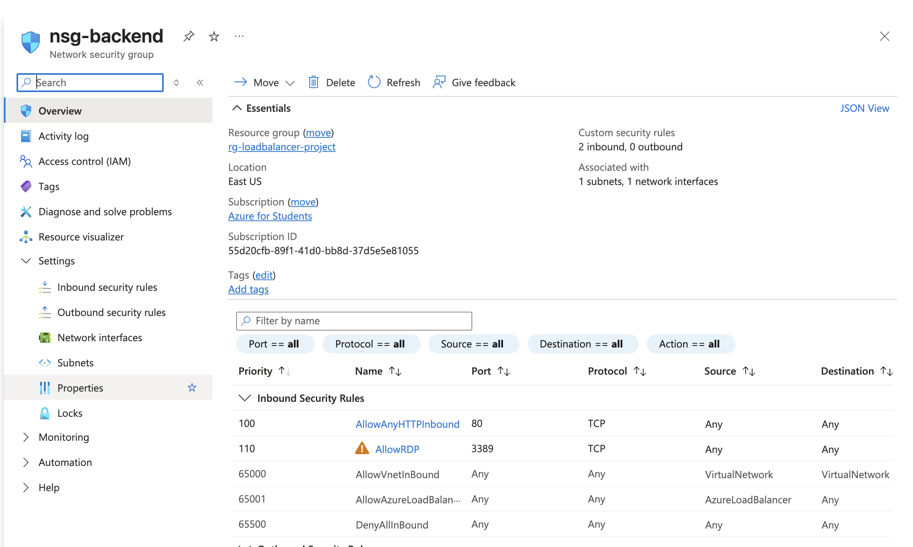
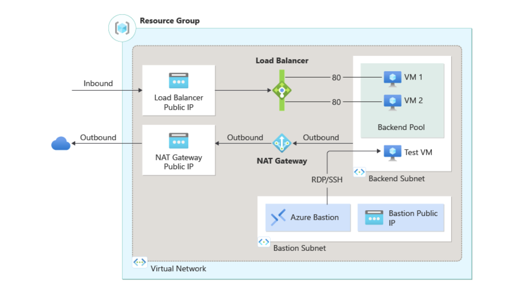

# Azure Load Balancer for E-commerce Platform

## High-Availability Web Infrastructure with Zone Distribution

## 🎯 Project Overview

This project demonstrates the implementation of a **zone-redundant Azure Load Balancer** to address the scalability challenges of a growing e-commerce platform experiencing traffic spikes during peak hours. The solution provides high availability, automatic failover, and even traffic distribution across multiple virtual machines.

### 🚀 Business Problem Solved

- **Traffic Surges**: Handle increased demand during peak shopping periods
- **Downtime Prevention**: Eliminate single points of failure
- **Performance Optimization**: Distribute load evenly across multiple servers
- **Scalability**: Support business growth with elastic infrastructure

## 🏗️ Architecture Overview

Internet  
↓  
[Public IP: 134.33.140.72]  
↓  
[Azure Load Balancer (Standard SKU)]  
↓  
[Backend Pool - Zone Distribution]  
├── VM1 (Zone 1) - IIS Web Server  
└── VM2 (Zone 1) - IIS Web Server  
↓  
[Virtual Network: 10.0.0.0/16]  
├── Backend Subnet: 10.0.0.0/24  
└── Bastion Subnet: 10.0.1.0/26

## ✨ Key Features Implemented

### 🔧 **Infrastructure Components**

- [x] **Resource Group**: Centralized resource management
- [x] **Virtual Network**: Isolated network environment with custom subnets
- [x] **NAT Gateway**: Secure outbound internet connectivity
- [x] **Network Security Group**: Firewall rules for traffic control
- [x] **Public IP Address**: Static IP for load balancer frontend
- [x] **Azure Load Balancer**: Layer 4 load balancing with health probes

### 💻 **Virtual Machines**

- [x] **Dual VM Setup**: lb-vm1 and lb-vm2 for redundancy
- [x] **Zone Distribution**: VMs deployed across availability zones
- [x] **Windows Server 2022**: Latest server operating system
- [x] **IIS Web Server**: Internet Information Services for web hosting
- [x] **Custom Test Pages**: Unique content for load balancer verification

### 🔒 **Security & Access**

- [x] **Network Security Groups**: Port-based access control
- [x] **Private IP Addressing**: Backend VMs without public exposure
- [x] **Azure Bastion Ready**: Secure remote access infrastructure
- [x] **RDP Access Controls**: Managed remote desktop connectivity

### 📊 **Load Balancing Features**

- [x] **Health Probes**: HTTP-based availability monitoring
- [x] **Session Persistence**: Configurable client affinity
- [x] **Backend Pool Management**: Automatic VM registration
- [x] **Traffic Distribution**: Round-robin load balancing algorithm

## 💰 Cost Analysis

| Resource                     | Monthly Cost (USD) | Annual Cost (USD) |
| ---------------------------- | ------------------ | ----------------- |
| Load Balancer Standard       | $18.25             | $219.00           |
| Virtual Machines (2x D2s v3) | $140.16            | $1,681.92         |
| Public IP Address            | $3.65              | $43.80            |
| NAT Gateway                  | $32.85             | $394.20           |
| **Total Estimated Cost**     | **$194.91**        | **$2,338.92**     |

_Note: Costs based on East US region pricing and may vary_

## 📸 Screenshots & Proof of Concept

The following screenshots demonstrate the complete implementation of the Azure Load Balancer infrastructure:

### 1. Resource Group Creation

_Initial setup of the resource group to organize all infrastructure components_

### 2. Virtual Network Setup

_Configuration of the virtual network with custom address space and subnets_

### 3. NAT Gateway Configuration

_NAT Gateway setup for secure outbound internet connectivity_

### 4. Load Balancer Setup

_Azure Load Balancer configuration with backend pools and health probes_

### 5. Virtual Machine Deployment

_Deployment of virtual machines across availability zones_

### 6. Network Security Group Configuration

_Network Security Group rules for traffic control and security_

### 7. Final Architecture

_Complete infrastructure showing all components working together_

---

<!-- Continue with the rest of your README content as needed -->
